# Mario Coin Platformer

**Mario Coin Platformer** — представляет собой небольшой платформер в стилистике серии игр Mario, построенный на базе библиотеки **Arcade**, языка программирования Python.

Данный платформер был создан для демонстрации базовых концепций библиотеки **Arcade**, однако также содержит в себе примеры использования **Tiled Map Editor**, ведь даже при создании простейших платформеров, использование конструкторов уровней является абсолютной необходимостью

# Что такое Arcade

**Arcade** — библиотека языка программирования Python с открытым исходным кодом, предоставляющая интуитивно понятный функционал для создания 2D-игр. Благодаря низкому порогу входа отлично подходит для первого знакомства с разработкой игр, или быстрому созданию прототипов для дальнейшей реализации проектов на более сложных инструментах

### Установка библиотеки
Данная библиотека доступна к скачиванию через пакетный менеджер **Pip**, поэтому ее установка может быть проведена одной командой

**Установка библиотеки arcade через Pip**
```bash
pip install arcade
```

# Создание макета уровня

Перед тем как приступить к использованию библиотеки **Arcade** для реализации логики игры, необходимо создать макет основного уровня игры, на котором будут размещены спрайты данного платформера.

При создании локаций рассматриваемой игры будет использован конструктор уровней **Tiled Map Editor**, который построен на концепции так называемых тайлов, и отлично подходит для создания локаций в играх подобного типа.

### Установка Tiled Map Editor
Данный инструмент доступен для скачивания с [официального сайта](https://www.mapeditor.org/) и имеет версии под большинство современных платформ. Процесс установки весьма тривиален, поэтому не будет подробно рассматриваться в рамках данного руководства


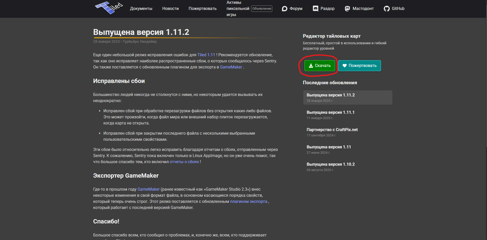
_Страница загрузки Tiled Map Editor_

## Создание новой карты
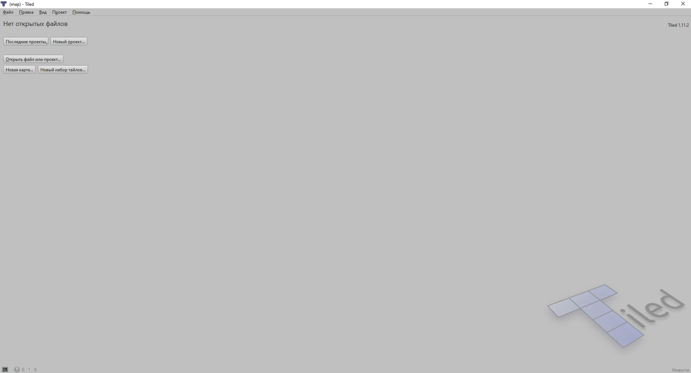
_Главное меню Tiled Map Editor_

После завершения процесса установки и запуска Tiled Map Editor мы можем наблюдать главное меню меню данной программы. Для начала работы нам необходимо создать карту, что можно сделать через действие NewMap, которое находится по пути **Файл>Новый>Новая карта....**

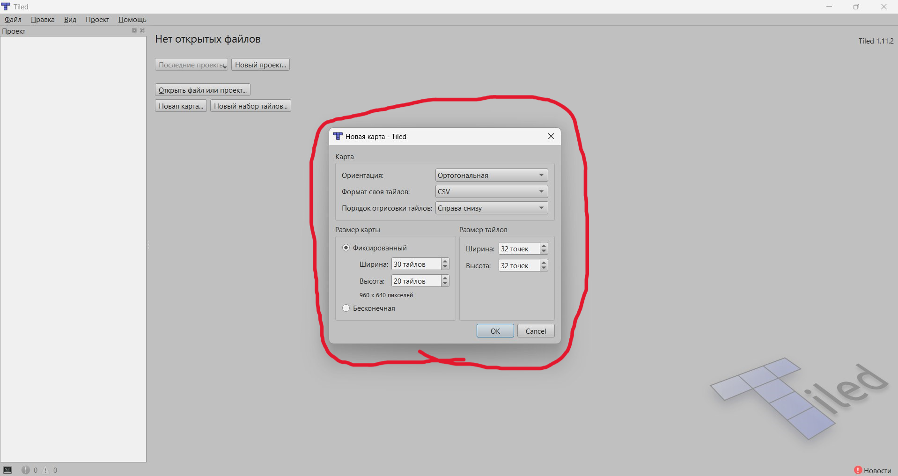
_Диалоговое окно создания карты_

После выбора данного пункта меню на экране появится диалоговое окно с базовыми настройками создаваемой карты. Данный проект имеет базовые настройки карты, поэтому мы создадим карту уровня без редактирования последних.

## Загрузка спрайтов
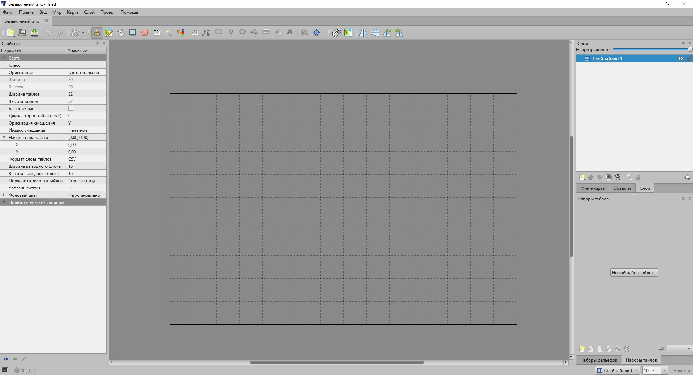
_Рабочая область Tiled Map Editor_

После успешного создания карты нам отображается рабочая область проекта в рамках которой будет проводится работа над картой уровня нашей игры 

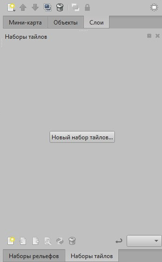

_Меню выбора тайлов_

Для продолжения работы над картой уровня возникает необходимость в наличии спрайтов для дальнейшего распределения по доступной области тайлов.

 К использованию в качестве спрайтов доступны изображения хранящиеся в распрастраненных форматах (PNG, JPEG, и т.д), однако в нашем случае будут использованы спрайты лишь в формате PNG. Для импорта спрайтов можно воспользоваться кнопкой с подписью **"Новый набор тайлов..."**, что расположена в правом нижнем меню отвечающем за работу с наборами тайлов (**tileset**)

## Работа со слоями

После создания пустой карты уровня и импортирования необходимых наборов тайлов, мы наконец-то можем перейти к реализации отдельных составляющих карты уровня, быть точнее к созданию ее слоев.

Для создания карты уровня представленного платформера, нам потребуется 3 основных слоя

- **Слой тайлов ground** — хранящий платформы нашей игры

- **Слой тайлов coins** — хранящий монеты для дальнейшего сбора игроком

- **Объектный слой Player** — назначение которого заключается в установке точки спавна игрока

### Создание слоя

Чтобы создать новый слой необходимо кликнуть правой кнопкой мыши по списку слоев карты, что расположен в правом верхнем углу и в открывшемся меню выбрать пункт **Новый>Слой тайлов** и выбрать название созданного слоя

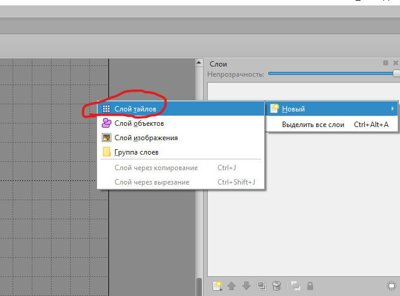

_Создание нового слоя_

### Размещение тайлов

В Tiled Map Editor присутствует широкий ряд инструментов для размещения, удаления и проведения других операций с тайлами. Среди основных инструментов, которые понадобятся нам при работе со слоями можно выделить такие как:

- **Штамп (Stamp)** — базовый инструмент предназначенный для точечного размещения спрайтов внутри тайловой сетки. Также поддерживает заполнение нескольких тайлов при их выборе в меню работы с тайлами

  

- **Ластик (Eraser)** — данный инструмент используется для точечного очищения тайлов от спрайтов добавленных ранее

  
  
- **Инструмент заливки форм (Shape fill tool)** — по принципу работы схож с выделением, однако в отличии от последнего служит только для заполнения выделенной области спрайтами

  

После окончания работы со слоями тайлов **ground** и **coins** должен быть получен результат подобный приложенному ниже

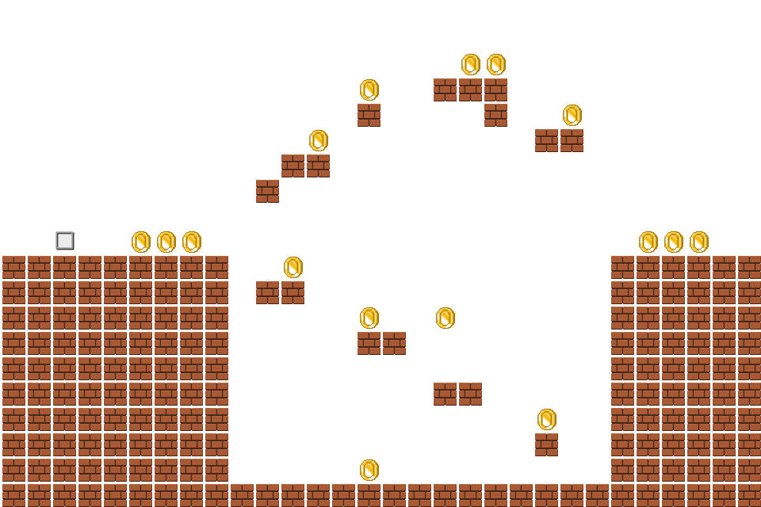
_Карта уровня экспортированная в формате png_

### Размещение точки спавна игрока

Заключительным шагом в создании карты является размещение точки спавна игрока на объектном слое. Для этого нам необходимо создать объектный слой, что можно сделать с помощью пункта меню **Новый>Слой объектов** в виджете управления слоями

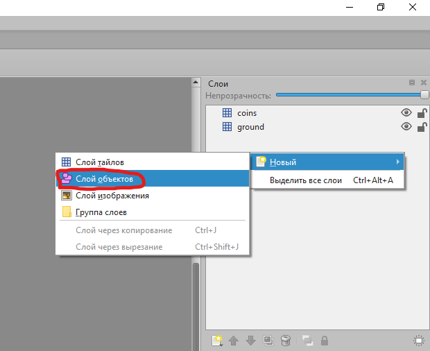

_Создание объектного слоя_

Теперь нам необходимо обозначить точку спавна на одном из тайлов объектного слоя, что можно сделать с помощью инструмента прямоугольника, расположение которого в панели инструментов представлено ниже

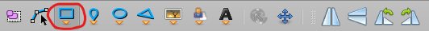

_Прямоугольник на панели инструментов_

### Экспорт тайловой карты
После создания карты уровня игры и установки точки появления игрока, карту необходимо экспортировать в формате **tmx**, для дальнейшего использования в рамках данного проекта. Чтобы провести операцию экспорта карты, нужно воспользоваться пунктом меню **Файл>Экспортировать как**

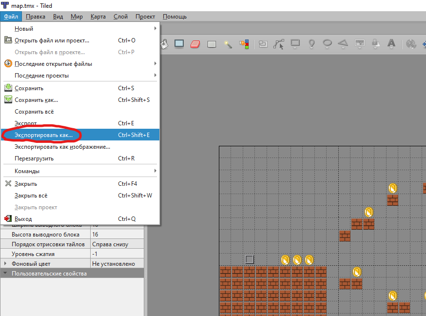

_Экспорт карты уровня в формате tmx_

# Написание игровой логики

В предыдущем разделе был рассмотрен пример создания простейшей карты уровня с платформами и монетами для сбора игроком. Однако для того, чтобы на основе реализованной карты создать полноценный платформер, необходимо описать игровую логику с помощью упомянутой ранее библиотеки Arcade, а также создать правильную иерархию проекта для упорядоченного хранения необходимых ресурсов. За некоторыми исключениями проекты подобного типа имеют следующую структуру:
```Game structure
 |— Game
 |  |
 |  |–– MarioPlatformer.py
 |  |
 |  |-- res
 |  |   |
 |      |– maps/
 |      |  | 
 |      |  |— map.tmx
 |      |  |
 |      |
 |      |– images
 |      |  |
 |      |  |– sprites..
 |      |  |
 |      |
 |      |– sounds
 |      |  |
 |      |  |– game sounds..
 |      |  |
 |      |
 |
```

Данная архитектура является оптимальным решением для небольших проектов, поэтому именно она будет использована в нашем проекте

## Cтруктура базового класса Window

Все классы игр созданные на базе библиотеки Arcade, являются дочерними классами по отношению к классу **Window**, который представляет собой главное окно созданной игры, и содержит в себе инструменты необходимые для реализации логики игры.

Также стоит отметить, что класс **Window** предъявляет разработчикам четкие требования к внутренней структуре класса, в которую входит распределение логики по заранее заранее определенным методам. Перечень основных методов, которые присутствуют в структуре данного класса, а также краткие описания их назначения приведены ниже

- **Базовый класс Window**
  
  - Метод **setup** — служит для конфигурации игры, например инициализации спрайтов, физического движка и т.д 
  
  - Метод **on_draw** — используется для прорисовки карты и спрайтов в области окна приложения

  - Метод **on_update** — в данном методе содержится событийный цикл игры, т.е происходит проверка изменений определенных условий, и запуск указанных алгоритмов при их изменении

  - Метод **on_key_press** — служит для перехвата нажатых игроком клавиш, действует по логике прописанной в теле метода

  - Метод **on_key_release** — перехватывает события отпускания клавиши игроком, является незаменимой функцией при создании игр, подразумевающих перемещения персонажа по оси Y

## Структура класса Platformer

### Конструктор класса
В контексте класса **Platformer**, конструктор предназначен для хранения базовых констант игры, например скорости игрока (**PLAYER_SPEED**), а также инициализации атрибутов, которые хранят необходимые для функционирования игры объекты

#### Структура конструктора класса

- Метод конструктор (**__init__**)

  - Метод **super().__init__()** — используется для инициализации родительского класса **Window**, а также передачи в родительский класс таких параметров как размер главного окна и его заголовок

  - Константа **PLAYER_SPEED** — хранит значение скорости игрока
  
  - Константа **PLAYER_JUMP** — служит для хранения значения высоты прыжка игрока

  - Константа **PLAYER_SCALING** — хранит значение масштаба спрайта персонажа по отношению к тайлу

  - Константа **TILE_SCALING** — содержит значение масштаба спрайтов из макета уровня по отношению к тайлу

  - Константа **COIN_SCALING** — служит для  хранения значения масштаба спрайта монеты по отношению к тайлу

  - Константа **GRAVITY** — хранит данные о силе гравитации внутри игры, используется при инициализации физического движка
  
  - Атрибут **tilemap** — предназначен для хранения объекта импортированного макета уровня

  - Атрибут **scene** — служит для хранения объекта сцены (**Scene**)

  - Атрибут **player** — инициализирован для хранения объекта спрайта игрового персонажа

  - Атрибут **ground_list** — предназначен для хранения списка спрайтов платформ. Генерируется из слоя **ground**, необходим для обеспечения коллизии

  - Атрибут **coins_list** — служит для хранения объектов спрайтов монет, и дальнейшего удаления собранных игроком монет

  - Атрибут **player_layer** — хранит спрайт объектного слоя **Player** для определения точки спавна игрового персонажа

  - Атрибут **physics_engine** — предназначен для хранения объекта физического движка

  - Метод **set_background_color(color)** — используется для установки фона создаваемого уровня, в нашем случае это **SKY_BLUE**

  - Атрибут **coin_sound** — содержит звук, который проигрывается при сборе монет игроком

#### Код конструктора класса
```python
def __init__(self, screen_width, screen_height, screen_title):
        super().__init__(screen_width, screen_height, screen_title)
        
        # Объявляем константы игры
        self.PLAYER_SPEED = 7 # Константа хранящая значение скорости игрока
        self.PLAYER_JUMP = 15 # Константа хранящая значение высоты прыжка игрока
        self.PLAYER_SCALING = 0.9 # Константа хранящая масштаб игрока по отношению к тайлу
        
        self.TILE_SCALING = 1.0 # Константа хранящая значение гравитации внутри уровня
        self.COIN_SCALING = 0.5 # Константа для хранения значения масштаба монеты по отношению к тайлу 
        self.GRAVITY = 1 # Константа содержащая значение гравитации
        
        self.score = 0 # Атрибут служащий для хранения текущего счета игрока 
        
        self.tilemap = None # Атрибут, инициализированный для хранения объекта карты уровня
        self.scene = None # Атрибут для хранения объекта сцены 'Scene'
        self.player = None # Атрибут для хранения объекта спрайта игрока
        self.ground_list = None # Атрибут служащий для хранения спрайтов из слоя ground
        self.coins_list = None # Атрибут для хранения спрайтов из слоя coins
        self.player_layer = None # Атрибут объявленный для хранения объектного слоя Player
        self.physics_engine = None # Атрибут для храния объекта физического движка
        
        arcade.set_background_color(arcade.csscolor.SKY_BLUE) # Устаавливаем SKY_BLUE в качестве фонового цвета уровня
        
        self.coin_sound = arcade.load_sound("res/sounds/coin_sound.ogg") # Атрибут для хранения звука взятия монеты
```

### Метод setup

Данный метод запускается сразу после инициализации класса Platformer, и больше не фигурирует в работе программы. Как можно понять из названия данного метода, его основная функция заключается в конфигурации игры перед ее запуском, т.е инициализации необходимых для работы игры объектов, установки коллизий на определенные слои и т.д

#### Структура метода setup()

- Метод **setup()**

  - Атрибут **tilemap** — хранит результат выполнения метода **load_tilemap()**, который используется для импортирования карты уровня

  - Атрибут **scene** — содержит экземпляр класса **Scene**, что используется создания игровой сцены
  
  - Атрибут **player** — хранит экземпляр класса **Sprite**, который был инициализирован для импортирования спрайта персонажа

  - Атрибут **player_layer** — предназначен для хранения списка, содержащий объект устанавливающий точку спавна игрока из объектного слоя **Player**

  - Операция присваивания к атрибуту **center_x** — устанавливает позицию спрайта игрока по оси X эквивалентную позиции объекта спавна из объектного слоя **Player**

  - Операция присваивания к атрибуту **center_y** — устанавливает позицию спрайта игрока по оси Y эквивалентную позиции объекта спавна из объектного слоя **Player**

  - Метод **add_sprite()** — принадлежит экземпляру класса **Scene**. Предназначен для добавления объекта спрайта игрока в игровую сцену

  - Атрибут **ground_list** — предназначен для хранения списка спрайтов из слоя **ground**

  - Атрибут **coins_list** — служит для хранения списка спрайтов монет из слоя **coins**

  - Атрибут **physics_engine** — хранит экземпляр класса **PhysicsEnginePlatformer**, или объект физического движка платформера

#### Код метода setup()
```python
    def setup(self) -> None:
        self.tilemap = arcade.load_tilemap("res/maps/map.tmx", self.TILE_SCALING, {
            "ground": {"use_spatial_hash": True},
            "coins": {"use_spatial_hash": True}
        }) # Инициализируем атрибут для хранения карты уровня

        self.scene = arcade.Scene.from_tilemap(self.tilemap) # Присваиваем объект Scene атрибуту scene

        self.player = arcade.Sprite("res/images/player.png", self.PLAYER_SCALING) # Присваиваем атрибуту player объект Sprite
        
        self.player_layer = self.tilemap.object_lists["Player"] # Присваиваем атрибуту player_layer объектный слой

        self.player.center_x = self.player_layer[0].shape[0] # Устанавливаем начальную позицию игрока по оси X
        self.player.center_y = self.player_layer[0].shape[1] # Устанавливаем начальную позицию игрока по оси Y

        self.scene.add_sprite("Player", self.player) # Добавляем спрайт игрока в сцену
        
        self.ground_list = self.tilemap.sprite_lists["ground"] # Присваиваем слой ground атрибуту ground_list
        self.coins_list = self.tilemap.sprite_lists["coins"] # Присваиваем слой coins атрибуту coins_list

        self.physics_engine = arcade.PhysicsEnginePlatformer(self.player, walls=self.ground_list, gravity_constant=self.GRAVITY) # Присваиваем атрибуту physics_engine объект физического движка
```


# Запуск платформера
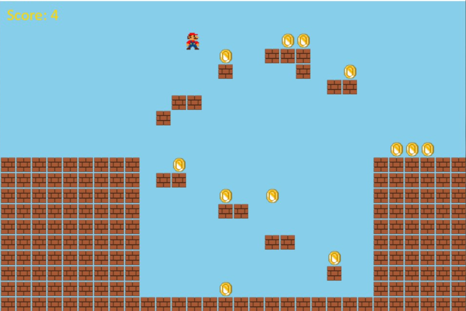

 _Скриншот игрового процесса 1_
